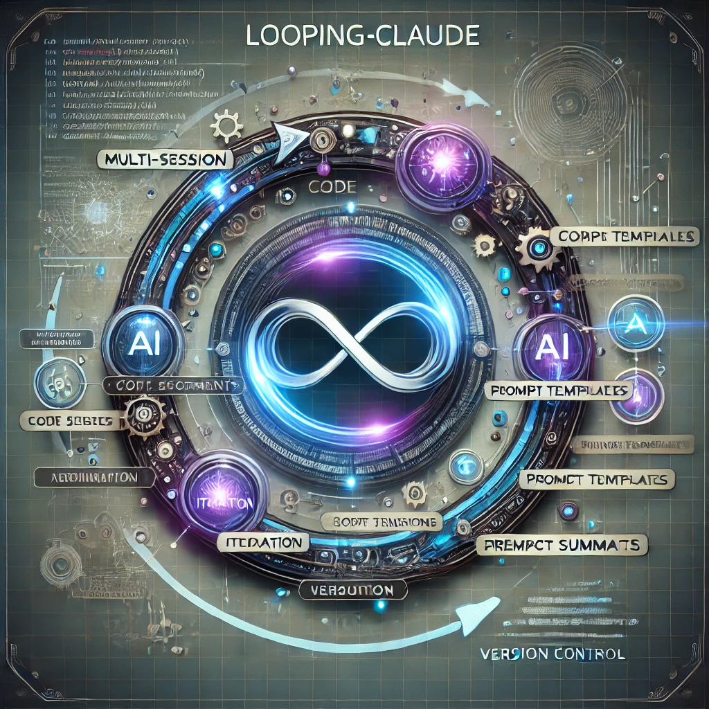
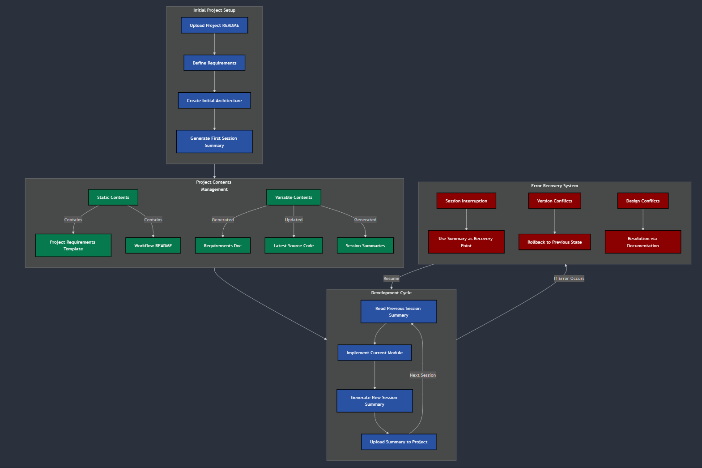
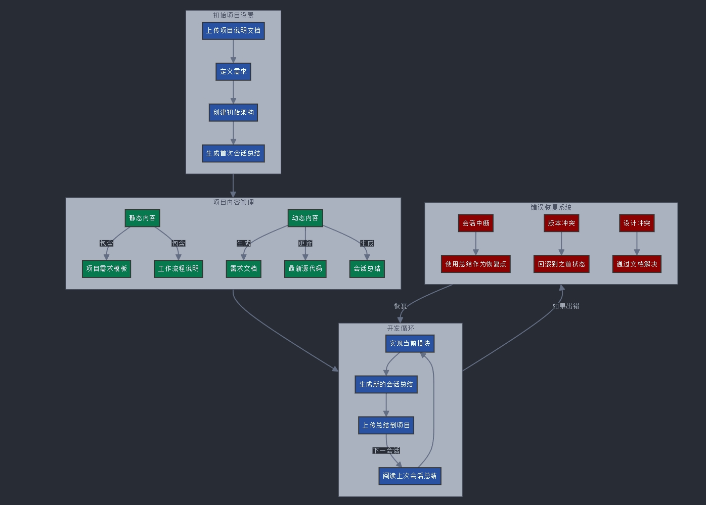

# Looping-Claude - Multi-session prompt system for using AI Agents on Complex Projects

## Project Overview
This project provides a structured approach for managing complex projects with AI agents like Claude across multiple chat sessions. It includes various artifacts and prompt templates to maintain continuity and context.

This project is inspired and developed using @richards199999 [Richard Tu](https://github.com/richards199999)'s ([Thinking-Claude](https://github.com/richards199999)) project, which given me the idea to use structured prompts and Claude's Project feature to overcome the limitation of maximum context of all AI Agent when we use them to develop large and complex projects. 

## System Diagram



## Example

Here's an example of using this approach and Claude.ai's project capability to create a simple I/O program over six chat sessions.

[Example: Simple I/O Program](./example/README.md)

It's fascinating to see Claude.ai come up with new requirements every time, adding features like multi-language support and test suites that the user didn't initially think of. This shows the potential of letting AI iterate continuously using this framework, as long as there's a good version control and rollback mechanism in place.

## README
This README is your guide to managing multi-session projects with Claude, ensuring everything stays consistent and on track.

## Workflow Process
1. **Initial Setup**
    - Upload this [Multi Session Workflow README](./src/multi-session-workflow-readme.md) to the AI Agent project so the AI understands our approach.
    - Upload this [Session Summary Template](./src/session-summary-template.md) to the AI Agent Project.
    - Define project requirements using the provided [Project-Requirements-Template](./src/project-requirements-template.md).
    - Use the provided [Project Initialization Prompt template](./src/workflow-prompt-templates.md#L3-L40) to work with the AI Agent and create the initial design.
    - Ask the AI Agent to generate a new session summary using the provided [Generate Session Summary Prompt](./src/workflow-prompt-templates.md#L91-L127).

2. **Development Cycle**
    - Upload the previous session's Session Summary to the AI Agent's project.
    - Prompt the AI agent to read the previous session summary using the [Continuation Session Prompt](./src/workflow-prompt-templates.md#L41-L90).
    - Work with the AI agent to implement the current module as defined in the [Continuation Session Prompt](./src/workflow-prompt-templates.md#L41-L90).
    
        ```markdown
        Continuing [Project Name] development
        Previous Session: [Session ID]
        Previous Version: v[X.Y]
        Current Version Target: v[X.Z]
        Previous Summary: [Reference]    
    - After the module is developed and tested, ask the AI Agent to generate a new session summary using the provided Session Summary template.
    - Upload the new session summary along with the code module created or updated in this session to the project. Make sure to update the version number in the code filename as advised by the AI Agent.
    - If you need to confirm what needs to be done before the next session, simply prompt: 
        ````    
        "Now, with the updated knowledge, confirm all human actions required to start the next chat session to continue the project. Make sure:
        1. The files you ask the human to upload exist in the chat session artifact list and have the correct content and version.
        2. Use clear specific filenames, for example, "test_suite.py" instead of "the test suite code".
        ````

    - Repeat the above process until all modules and requirements are satisfied and tested.

## Core Artifacts
1. **[Project Workflow README Template](./src/multi-session-workflow-readme.md)**
2. **[Project-Requirements-Template](./src/project-requirements-template.md)**
3. **[Session Summary Template](./src/session-summary-template.md)**
4. **Session Initiation and Continuation Prompts**
    - **[Project Initialization Prompt template](./src/workflow-prompt-templates.md#L3-L40)**    
    - **[Continuation Session Prompt](./src/workflow-prompt-templates.md#L41-L90)**
    - **[Generate Session Summary Prompt](./src/workflow-prompt-templates.md#L91-L127)** 

# Looping-Claude：基于Claude.AI的多会话AI复杂项目开发框架

该项目灵感来源于@richards199999（Richard Tu）的Thinking-Claude项目，旨在通过结构化提示和Claude的项目功能，克服所有AI代理在处理大型复杂项目时的上下文限制。

## 系统架构图



这个项目通过多会话提示系统，确保AI代理在不同会话中保持连续性和上下文一致性，特别适合大型复杂项目。

## 亮点功能：

### 结构化提示模板：轻松管理项目需求、会话总结和初始化提示。

### 多会话支持：
通过多个聊天会话逐步完成项目，确保每个步骤都清晰可控。

### 示例教程：
提供简单I/O程序的详细示例，手把手教你如何使用。

## 工作流程：
本README提供了全面的指南，帮助你在多会话项目中管理Claude，确保会话之间的一致性和连续性。

### 初始设置

1. **上传多会话工作流程README到AI代理项目，让AI代理理解我们的整体方法。**
2. **上传会话总结模板以及本次会话生成的代码到AI代理项目（如果是更新已有代码则需要修改文件名中的版本号）。**
3. **使用提供的项目需求模板定义项目需求。**
4. **使用项目初始化提示模板与AI代理合作，创建初始架构设计。**
5. **提示AI代理生成新的会话总结，使用生成会话总结提示。**

### 开发周期

1. **将上一个会话的会话总结上传到AI代理项目。**
2. **提示AI代理阅读上一个会话总结，使用继续会话提示。**
3. **与AI代理合作，按照继续会话提示中的要求实现当前模块。**
4. **在模块开发和测试完成后，要求AI代理生成新的会话总结。**
5. **将新的会话总结，新增的和更新的代码（文件名记得带上版本号）上传到项目内容中。**
6. **重复上述过程，直到所有模块和需求都得到满足和测试。**

# 立即体验：[示例教程](./example/README.md)
